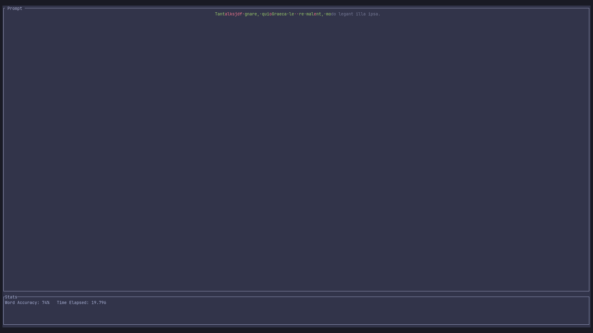
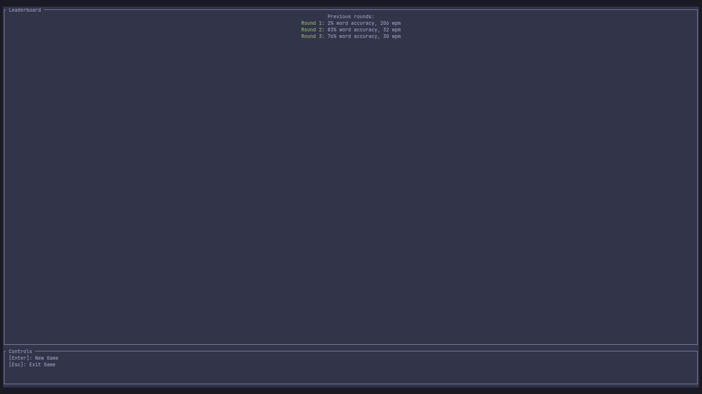

# Terminal Typer
Do you ever worry about how many words-per-minute you can type? Do you ever
feel that going to a website to test this is too much effort. Or do you
simply want to procrastinate from within the comfort of your own terminal?
Then `terminal_typer` is for you!

# Screenshots

Typing out a short, test prompt:


The round-end screen:



# Installation
This application is still in early stages of development, and is not currently
packaged in any repositories. To use it, simply build from source using
`cargo`.

```bash
git clone git@github.com:callum-jones19/terminal_typer.git
cd terminal_typer
cargo build --release
./target/release/terminal_typer
```

Once the binary is built, feel free to move it to a directory in your PATH if
you would like

# Features
- [x] Round-based gameplay loop, with a record of all played rounds.
- [x] Words-per-minute and time-tracking.
- [x] Randomised prompt text (may or may not currently be in a certain
  dead language).
- [ ] Sleek interface.
- [ ] English prompt text.
- [ ] Persistent records with detailed and ordered stats.

